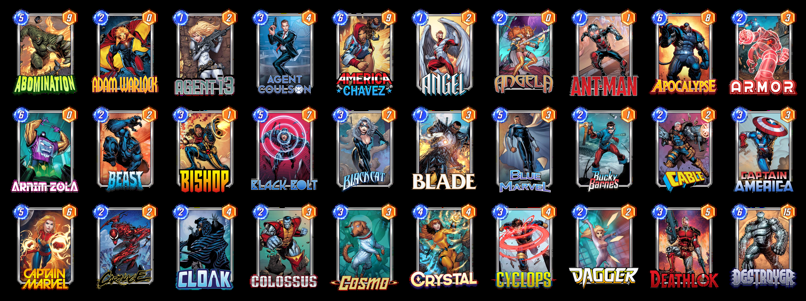

# Marvel-SNAP Owned Cards Grid Maker

this simple script will look into your game files and extract your owned cards, then download them from the web and puts them in a simple grid like this:

it is useful when you need to share your collection with other people for deck recomendation and card replacements in a specified deck.

there is no extra option to run it, just call the python script.
Enjoy :)
